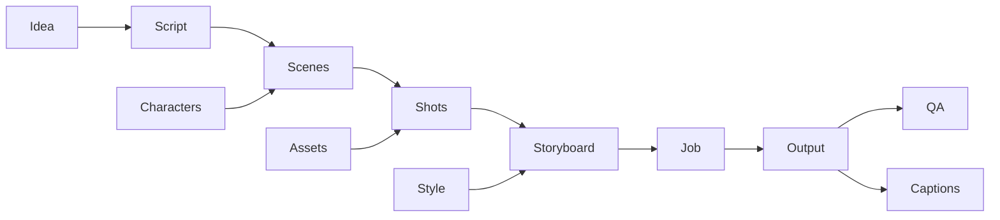

# 1. How VideoFlow works

[Handbook](README.md) · Next: [Install](02-installation.md)

VideoFlow is a local video production workspace. Your database and media files live on your computer. AI generation sends prompts and selected references to configured external providers; local storage does not mean offline AI.

## The working model

A **project** contains a story, its reusable people and objects, and its output history. A **script** is divided into **scenes**. Each scene has ordered **shots** that describe individual beats. **Characters** record appearance and behavior; **assets** hold reference files and generated media. A **storyboard** is an image contact sheet showing planned shots. A **render job** asks a provider for video, and an **output** is the downloaded result.

The diagram shows application relationships. The default AtlasCloud H3 Developer Reference-to-Video route sends selected image references, including a storyboard when a direct render has no other reference. H3 Developer Text-to-Video sends a prompt without image references. Provider capability still determines what the generated video follows.

## Two ways to work

**Create video** runs the script, scene, shot, dialogue, storyboard, and render-submission stages for you. Before it starts, review the local preflight summary for the selected routes, format, duration, resolution, reference limit, and audio support. Preflight checks configuration without contacting providers. Create produces scene jobs; it does not currently stitch all scenes into one finished movie.

**Advanced** exposes the same stored work in Scenes, Characters, Assets, and Studio. Use it to inspect the script, correct identities, adjust shot durations, and recover intermediate work. Changes to a scene do not rewrite an already generated video. Generate another take after editing.

## The philosophy in practice

1. Write a clear intent: subject, action, setting, audience, style, and language.
2. Establish reusable character and style information before repeated generations.
3. Review inexpensive text artifacts before paying for image and video work.
4. Treat generated outputs as takes. Preview them, inspect QA, and select deliberately.
5. Keep intermediate work and use targeted retries instead of restarting the whole story.

Schema validation checks that AI replies have the expected structure. It cannot guarantee that the story makes sense, the provider follows every visual instruction, or the resulting speech matches the script. Human review remains part of the workflow.

These principles serve as implementation rules and workflow guidelines for VideoFlow.
